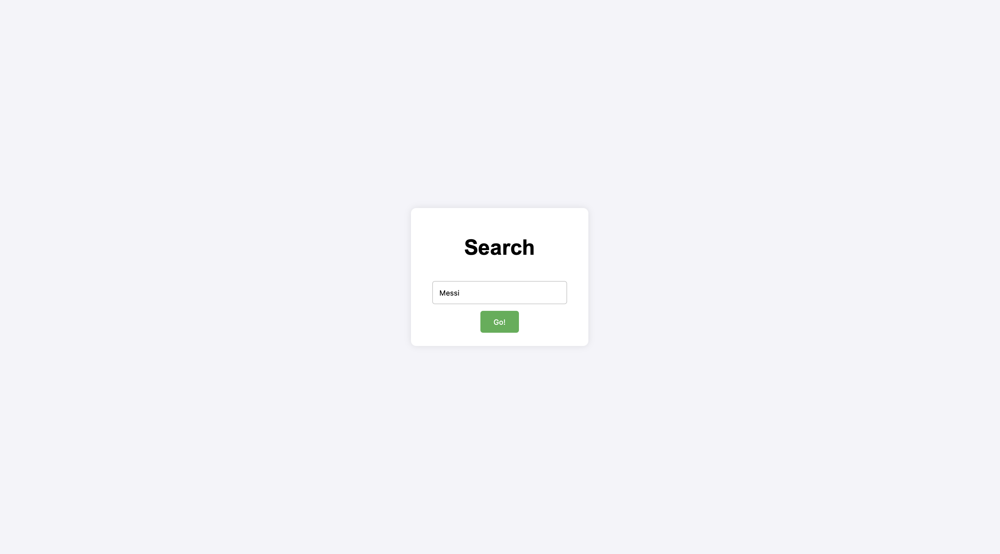

# OpenAI Search Summarizer

This is a simple starter web app to demonstrate how to get started with using OpenAI's APIs. The project demonstrates basic usage of using search results to augment an LLM's response.

## Pages Overview

### Home Page

The home page provides a searchbar the user can use to input their query.

### Search Results Page

Outputs the results of the OpenAI API.

